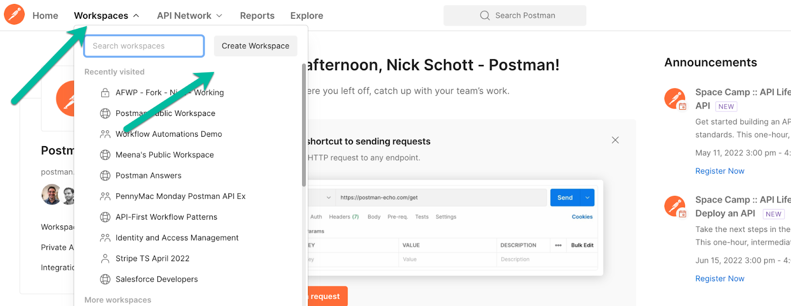

### 

## Postman - Hands-On Workshop

Module 2: Developer Productivity

* This lab will show you some of the new features in Postman v9, including how to work with multiple collections associated with an API.
* Topics covered: collections, API versions, API specs, documentation, mock servers, variables, and environments.

### Prerequisites

1. Ensure you have a Postman account set up through your company’s official instance.
2. Log into that Postman account at postman.com.

### Hands-On Lab - Phone Book API Workshop

    We will use a copy of the API spec for the Phone Book API as the sample for our hands-on workshop labs.

1. _Create a new workspace._ (Click Workspaces -> create workspace in the top left of the screen.) Name the workspace for the workshop we will be doing, and add your initials to the end. For example, you could name the workspace _Postman Workshop - &lt;<your initials or name>>. _
    1. Please prefix the workshop name with “Postman Workshop” to help with organization. Also, add your initials to the end of the workspace to help keep track of whose is what!
    2. **Tip: Workspaces make it easy to share your work and collaborate with teammates without needing to import / export collections.**

        

        

        Set the workspace visibility to Team or Private.

2. C_reate a new collection _in the workspace you just created_. _(Near the top-left of the screen, click New -> then select Collection.) Name your collection anything you like, such as “My First Collection.”
    3. **Tip: Feel free to take a look at the other types of “building blocks” this screen lets you create with Postman.**

        

3. _Create a new API. _(Near the top-left of the screen, click New -> then select Collection.)

        

4. _Set the API name_ to “_Phone Book Workshop API_” and set the version to _1.0.0_. Then click Create API.
    4. **Tip: We support many types of schemas and protocols - feel free to explore the dropdowns.**

    

5. _Populate the OpenAPI 3 Spec._
    5. Click into API version 1.0.0, then click view schema. Replace the API definition with the one linked below. Click Save.
        1. [https://github.com/OAI/OpenAPI-Specification/blob/main/examples/v3.0/uspto.yaml](https://github.com/OAI/OpenAPI-Specification/blob/main/examples/v3.0/uspto.yaml)
        2. [https://raw.githubusercontent.com/OAI/OpenAPI-Specification/main/examples/v3.0/uspto.yaml](https://raw.githubusercontent.com/OAI/OpenAPI-Specification/main/examples/v3.0/uspto.yaml) 
    6. **Tip: You can navigate the API spec easily with the outline on the left.**

        

6. _Explore documentation._ Click the “Documentation” link near the top to explore the auto-generated Postman documentation as a collection.
    7. **Tip: This makes it easy for folks to discover and explore your APIs.**
7. _Generate a mock server. _Click “Generate Collection” in the top-right, name the collection the same as your API (without the word API). Select the option for “API Mocking” (bottom-right)
    8. **Tip: Postman will now generate a collection for this API, as well as a mock server.**

        

        

    9. Name the mock server something simple, and click “Create Mock Server.” **Be sure to check the box “save the mock server URL as an environment variable.”**

        

8. Click close on the bottom right of the “mock server was created” screen. Then close the inner tab with the API version and OpenAPI spec as well.

        

        

    **→ Tip: Several things just happened. **

1. **A collection was created (based on the OpenAPI spec), which can be used for mocking and documentation. Even testing. **
2. **A mock server was created, which emulates that collection. **
3. **An environment which sets the mock server URL as a variable was generated.**
1. Let’s _explore the collection we just generated_, and invoke the mock server.
    1. Click Collections -> select the generated Phone Book Collection.
    2. **Tip: Click around the folders (api/vi, phonebook/{mdn}/entries) to see the auto-generated requests and sample responses!**

        

2. _Review the auto-generated collection documentation_ - click the three dots next to the collection name, and select “view documentation.” Then browse the RESTful resources / verbs on the right.
    3. **Tip: This automation can save you a lot of time, when _producing_ and _consuming_ APIs. Document APIs faster … build APIs faster. Find and start using APIs faster!**

        

        

3. _To utilize the mock_, update the collection URL and response.
    4. Expand the GET request for “Returns device information” so you can see the responses under it. Then click on the first response, “Success.”

        

 

    5. Change the syntax of the MDN URI param so it will match for the mock server. Change `:mdn` to `{{mdn}} `as shown below. Be sure to click save in the top right.

        Change this:

        

        To this, and click save:

        

4. Almost there! Let’s select the Phone Book Mock environment from the list of environments in the top-right, then click the eye icon to “quick look.”
    6. **Tip: We can use environment variables to avoid duplicating base URL’s and other values across our requests.**

        

    7. Update the variable name `url` to `baseUrl` and click save.

        

5. Invoke the mock server by selecting the GET for “Returns device information…” and clicking Send.

        

        

1. **Tip: The mock server and collection auto-generated a mock response that conforms to the schema from the OpenAPI spec, so that API producers and consumers can test with a live endpoint while iterating on the API design and implementation.**

This concludes the workshop - the assets in your workspace are good samples for launching future projects.

Congratulations! You just successfully created (and consumed!) an API, collection, mock, environment, and documentation in Postman.

Where to next? Perhaps you’d like to learn about Postman tests, or explore the Postman API network linked below!

Learn more: 

* Postman Test Script Getting Started and Examples: [https://learning.postman.com/docs/writing-scripts/script-references/test-examples/#getting-started-with-tests](https://learning.postman.com/docs/writing-scripts/script-references/test-examples/#getting-started-with-tests)
* Postman Learning Center: [https://learning.postman.com/](https://learning.postman.com/)
* Postman Public Workspace: [https://www.postman.com/postman](https://www.postman.com/postman) 
* Postman API Network: [https://www.postman.com/explore](https://www.postman.com/explore)
* Postman Homepage: [https://www.postman.com/](https://www.postman.com/) 

Postman can help you along the way with the entire producer and consumer API lifecycle:

